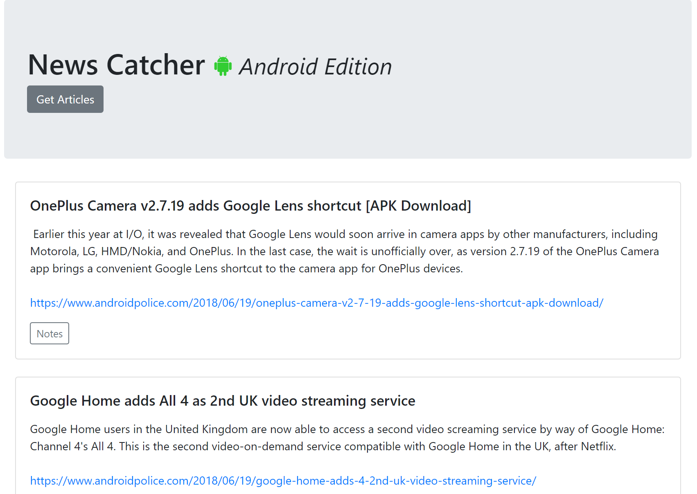
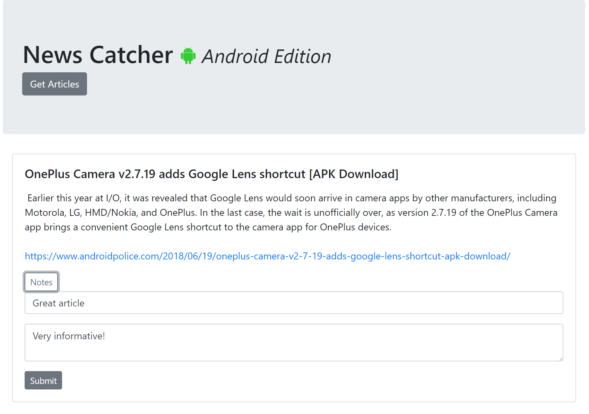

# News Catcher: Android Edition

## About this Project
This app scrapes a news website for headlines and article summaries, saves them to a MongoDB and allows the user to input notes for each article.

Technologies used in this app include Node.js, Express, Body-Parser, MongoDB/Mongoose and Handlebars.

## Screenshots
Articles displayed in a blog style

Notes can be saved for each article (`
` revealed with jQuery)

## Install and Run
Clone the repository to your local machine. Run `npm install` to install the dependencies. Then run `npm start` to start the server on `localhost:3000`.

## Deployed Site
[https://nameless-temple-46031.herokuapp.com/](https://nameless-temple-46031.herokuapp.com/)

## My Portfolio
[https://joseph526.github.io/](https://joseph526.github.io/)
